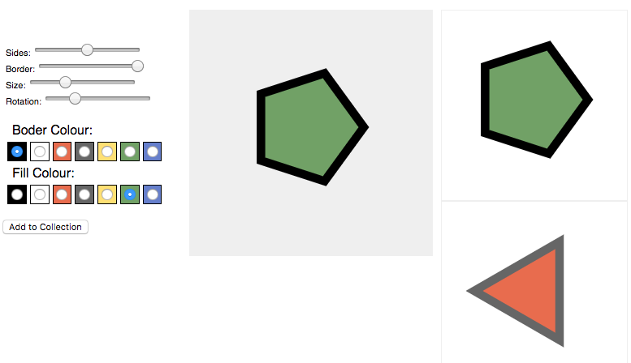

# admataz shape shop

This a little experiment with [react.js-driven](https://facebook.github.io) to make an interactive SVG shape maker. 

See the [demo](http://demo.admataz.com/shape-shop/).

The purpose of this is to exercise the part of my brain that understands React and Javascript. 

### License
License: [MIT 2017 Adam Davis](./license.txt)